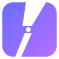
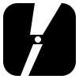
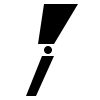

# RN Logo — "VB: Dynamic"

## Concept

ポートフォリオサイトのロゴマーク。角丸正方形（スクエアアイコン）に、分割スラッシュをネガティブスペースとして配置したデザイン。

## Design Story

ロゴは上から下に **R → Bridge → N** のストーリーを持つ:

<p align="center">
  
  &nbsp;&nbsp;&nbsp;
  
  &nbsp;&nbsp;&nbsp;
  
</p>

- **Upper slash** — R のレッグ（脚）。太い・斜め（~28°）でダイナミック
- **Bridge node** — 接続点。AI と現実世界をつなぐ橋渡し
- **Lower slash** — N の最終ストローク。細い・垂直寄り（~8°）で安定感

### Design Elements

| Element         | Description                                                               |
| --------------- | ------------------------------------------------------------------------- |
| **Squircle**    | 角丸正方形 (rx=18 on 100x100 viewBox)。ブランドグラデーションで塗りつぶし |
| **Upper slash** | 幅広で斜め (~28°)。R のレッグ（脚の対角線）を想起                         |
| **Lower slash** | 幅が狭く垂直寄り (~8°)。N の最終ストロークを想起                          |
| **Bridge node** | 2つのスラッシュ間の小さな円 (r=4)。回路のジャンクション / AI×現実の接続点 |

### Hidden Narrative

- **角度の変化**: 斜め → 垂直 の遷移が R → N のイニシャルを暗示
- **太さの変化**: 太 → 細 の遷移が「実行力（動的）→ 安定（静的）」を表現
- **Bridge**: 「AI（流動的）と現実世界（堅牢）の橋渡し」というブランドステートメントの視覚化

## Variants

| File                  | Background                 | Slash | Use Case                                        |
| --------------------- | -------------------------- | ----- | ----------------------------------------------- |
| `logo-gradient.svg`   | #686dff → #b66fff gradient | White | Primary。ヒーロー、マーケティング、OG画像       |
| `logo-mono-black.svg` | Black (#000)               | White | ライト背景向け。印刷、モノクロ利用              |
| `logo-mono-white.svg` | White (#fff)               | Black | ダーク背景向け。オーバーレイ利用                |
| `logo-auto.svg`       | Black / White (auto)       | Auto  | prefers-color-scheme で自動切替。ファビコン候補 |

## Favicon Files (in `public/`)

| File                   | Size     | Purpose                           |
| ---------------------- | -------- | --------------------------------- |
| `favicon.svg`          | Scalable | モダンブラウザ向け SVG ファビコン |
| `favicon-32x32.png`    | 32x32    | レガシーブラウザフォールバック    |
| `apple-touch-icon.png` | 180x180  | iOS ホーム画面ブックマーク        |
| `site.webmanifest`     | -        | PWA マニフェスト                  |

## Brand Colors

| Name            | Hex                         | Role                   |
| --------------- | --------------------------- | ---------------------- |
| OmniCore Blue   | `#686dff`                   | Gradient start         |
| OmniCore Purple | `#b66fff`                   | Gradient end           |
| Gradient        | `135deg, #686dff → #b66fff` | Primary brand gradient |

## SVG Geometry (100x100 viewBox)

```xml
<rect x="4" y="4" width="92" height="92" rx="18" />
<polygon points="44,4 78,4 54,44 38,44" />   <!-- Upper: R's leg -->
<circle cx="48" cy="50" r="4" />               <!-- Bridge node -->
<polygon points="42,56 54,56 36,96 26,96" />   <!-- Lower: N's stroke -->
```

## Regenerating PNGs

```bash
bun run -e "
import { Resvg } from '@resvg/resvg-js';
import { readFileSync, writeFileSync } from 'fs';
const svg = readFileSync('src/assets/logo/logo-gradient.svg', 'utf8');
for (const [s, n] of [[32,'public/favicon-32x32.png'],[180,'public/apple-touch-icon.png']]) {
  writeFileSync(n, new Resvg(svg, {fitTo:{mode:'width',value:s}}).render().asPng());
}
"
```
